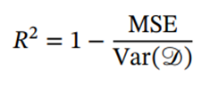

# 
Algoritmos Genéticos (Trabajo IA Universidad de Sevilla 2024)

### 
Autoras: María de la Salud Carrera Talaverón y Natalia Olmo Villegas

## Índice

1. [Introducción](#id1)
1. [Métodos Empleados](#id2)
1. [Descripción y Diseño de los Elementos Clave del AG](#id3)
1. [Bibliografía](#id4)

## Introducción

Los objetivos específicos de este trabajo son diseñar e implementar un AG en Python capaz de resolver un problema de regresión dado un conjunto de datos y, además, ejecutar una batería de experimentos sobre ciertos conjuntos de datos proporcionados.

A grandes rasgos, se ha decidido enfocar este problema de la siguiente forma: un individuo está compuesto por una serie de coeficientes de la ecuación de regresión, la cual se comentará más tarde. La aptitud de cada individuo se evalúa utilizando el coeficiente de determinación. El cruce y la mutación se llevaron a cabo en base de la probabilidad de cruce y la probabilidad de mutación. La selección de los padres se realiza mediante un proceso de torneo, y la selección de individuos para la próxima generación mediante reemplazo por elitismo para preservar los mejores individuos.

## Métodos Empleados

- Representación de los individuos: Un array del tamaño de los coeficientes de regresión de acuerdo a la ecuación de regresión, pues serían entonces 2 coeficientes por cada atributo, “ci” un coeficiente multiplicando al valor de dicho atributo, “ei” un exponente asociado al valor del atributo; y “C” el valor de una única constante. Cada celda del array representará cada uno de estos coeficientes. Los valores de este en un primer momento serán valores enteros entre el intervalo [-2,2], aunque luego se podrán convertir en números de tipo flotante.

    

- Función fitness: se evalúa cómo de bueno será el individuo dado y lo hará mediante ecuación de regresión y coeficiente de determinación. Se trata de maximizar el coeficiente de terminación para obtener soluciones más precisas.

    

- Selección de padres: selección por torneo. Esta se basa en escoger un número k de individuos de la población aleatorios, y escoger el mejor de entre ellos para formar parte de la población de padres. Este proceso se repetirá tantas veces como número de individuos hijos sean necesarios generar posteriormente.

- Selección de siguiente población: Reemplazo generacional con elitismo. Se escoge un porcentaje de los mejores individuos de la población actual, los cuales pasarán directamente a la siguiente generación, mientras que el resto de la población vendrá dada directamente por la nueva población de hijos que van a someterse a una serie de operaciones de cruce y mutación.

- Operador de cruce: cruce uniforme. En este, cada gen de la descendencia tiene las mismas probabilidades de pertenecer a un padre u otro. Se genera una máscara de cruce con valores binarios. Si en una de las posiciones de la máscara hay un 1, el gen situado en esa posición en uno de los descendientes se copia del primer padre. Si por el contrario hay un 0 el gen se copia del segundo padre. Para producir el segundo descendiente se intercambian los papeles de los padres, o bien se intercambia la interpretación de los unos y los ceros de la máscara de cruce. Entonces, la descendencia contiene una mezcla de genes de cada uno de los padres. Este cruce se va a producir en base a la probabilidad de cruce elegida al principio.

- Operador de mutación: Para cada uno de los individuos en la población de hijos se decide, en base a la probabilidad de mutación, si se muta o no un gen. En este caso, se ha optado por el reemplazo aleatorio: se selecciona un gen al azar, y se modifica su valor por 1 menos el antiguo valor de dicha posición. La probabilidad de mutación es muy baja, suele ser menor al 1% y las mutaciones se realizan para garantizar que ningún punto del espacio de búsqueda tenga una probabilidad nula de ser examinado.

## Descripción y Diseño de los Elementos Clave del AG

Para el diseño de este algoritmo, en primer lugar, se ha creado el archivo “AG_marcartal1_natolmvil.py”, el cual será llamado desde “prueba_AG.py”, el archivo que ha sido proporcionado por los profesores de la asignatura.
Asimismo, se han creado otros archivos: “fitness.py”, “operadores.py” y “selección.py” por razones de organización, pues si todos los métodos y funciones estuvieran en un mismo archivo, se aumentaría la complejidad cognitiva.

En el siguiente esquema se muestran los métodos de los archivos, así como las relaciones y las llamadas recursivas entre ellos. Los nombres de los archivos aparecerán marcados en negrita, para diferenciarlos de los nombres de los métodos

A continuación, se van a explicar en detalle cada uno de los métodos contenidos en estos archivos.
El método “\_\_init__” se encarga de recoger los datos de los csv y guardar esos valores en las variables correspondientes. Asimismo, hará una llamada al método “población_inicial”, encargado de generar una primera generación de individuos aleatoriamente representando a cada individuo por los coeficientes de la ecuación de regresión, esto es dos coeficientes por cada atributo y el coeficiente final. Estos valores aleatorios estarán comprendidos entre -2 y 2. 

A continuación, se ejecuta el método “run”, en el que se definen las probabilidades de cruce y mutación, respectivamente. Además, se llama a los métodos “algoritmo_genetico” y “mejor”.

El diseño del algoritmo genético se encuentra contenido en este primer método, “algoritmo_genetico” y es de importancia destacar que este ha sido diseñado e implementado siguiendo todas las directrices del pdf proporcionado por el profesorado. A continuación, se muestra en pseudocódigo lo que ocurre en este método para comprender mejor el funcionamiento del algoritmo:

Ahora se procede a analizar en más detalle las funciones de este algoritmo.
- *fitness_poblacion*: Este método se encarga de evaluar a los individuos según la ecuación de regresión para determinar las predicciones de los valores objetivos. Además, se evaluará cómo de buenas han sido esas predicciones en función del coeficiente de determinación, que compara el error cuadrático medio con la varianza de los valores correctos, que sería el error que cometería un modelo que siempre proporcionara como salida la media de los valores correctos.

    El coeficiente de determinación toma valores en el intervalo (−∞, 1), donde 1 correspondería a un modelo que hiciera predicciones correctas para todos los ejemplos y el valor 0 a un modelo que siempre predijera la media de los valores correctos. Un modelo con un coeficiente de determinación negativo tendría un rendimiento peor que predecir siempre esa media. Por lo tanto, a la hora de indicar qué valores son los mejores devolveremos aquellos cuyo fitness sea mayor.

- *seleccionar_padres*: Este método consiste en seleccionar a un conjunto de individuos, con repetición en este caso, de la población actual para el posterior cruce y mutación y obtención de nuevos hijos. En esta ocasión, se ha optado por seleccionar los padres mediante torneo, escogiendo k=5 y redondeando el número de individuos teniendo en cuenta el procentaje de elitismo. Además, se ha considerado que este número no sea impar, para que no se generen inconsistencias con los tamaños de los datos obtenidos. Entonces, de entre todos los posibles padres se escogerán de entre esos 5 elegidos aleatorimente, el que tenga un fitness mayor para conseguir unos resultados mejores.

- _cruzar_: Este método trata de generar nuevos individuos (hijos) a partir de los que se han seleccionado de la población, mezclando o combinando dos de los individuos seleccionados (padres) en base a una probabilidad de cruce. Cada par de padres da lugar a un par de hijos. Se han diseñado diversos algoritmos de cruce (un punto, dos puntos, uniforme y extensión) y, finalmente, se ha optado por utilizar el cruce uniforme.

- _mutar_: Este método consiste en modificar (o no, dependiendo de la probabilidad de mutación) un gen al azar de cada hijo generado en la función de cruce. El operador implementado modifica en una unidad el valor del gen escogido para la mutación.

- _seleccionarSiguientePoblacion_: Este método consiste en seleccionar la siguiente población basada en el porcentaje de elitismo, una vez se tiene la nueva población de hijos cruzados y mutados. En nuestro caso, se ha seguido el método de  reemplazo generacional con elitismo. Para ello, se han escogido los mejores padres en función del porcentaje de elitismo, 0.1 en este caso, y el fitness de los individuos de la población inicial, y estos pasan directamente a la siguiente generación. A continuación, se han sumado a la nueva población los hijos cruzados y mutados. Cabe destacar que previamente se ha realizado una comprobación para determinar que el número de padres así como el de hijos sean pares para evitar inconsistencias.

Aunque se realizaron una serie de experimentos para averiguar qué combinación de hiperparámetros era la más eficiente en cuanto a resultados obtenidos, no se van a detallar en este README. Basta mencionar que los resultados obtenidos indican que la mejor configuración para el algoritmo genético es: probabilidad de cruce de 0.7, operador de cruce uniforme y objetivo maximizar R². Además, se encontró que inicializar la población con números reales, en lugar de enteros, produce mejores resultados en general.

## Bibliografía

- https://aprendeia.com/algoritmos-geneticos/
- http://sabia.tic.udc.es/mgestal/cv/AAGGtutorial/aagg.html